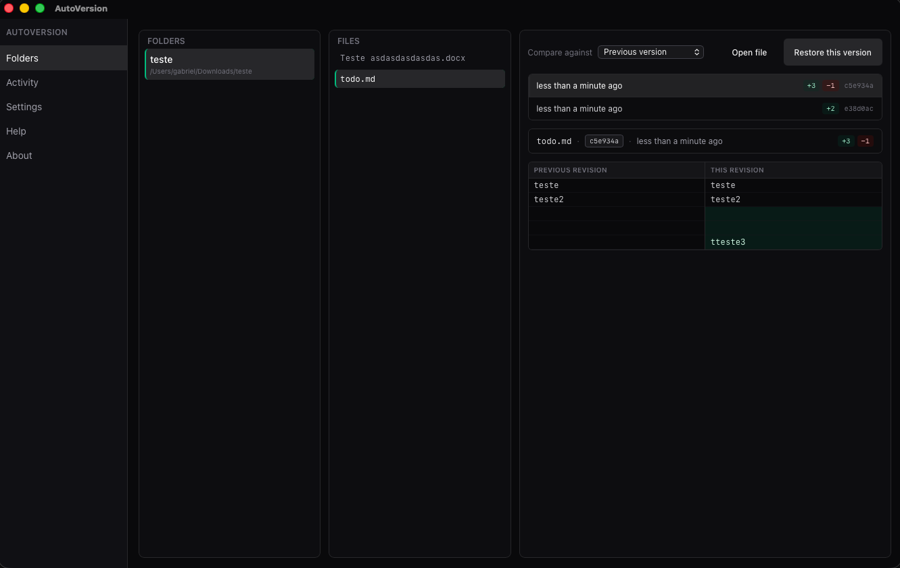

# AutoVersion



[](https://github.com/menezes-/autoversion/releases/latest)
[](LICENSE)
[](#)

> Auto-save versions of whatched files in a folder, so you can roll back a `.docx` (or anything else) when an AI agent — or you — break it.

AutoVersion is a macOS menu-bar app that quietly snapshots files into hidden per-folder git repos on every save. You get full history, format-aware diffs, and one-click restore, without ever touching `git`.

## Install

1. Download the latest **`AutoVersion_<version>_aarch64.dmg`** (Apple Silicon) or **`_x64.dmg`** (Intel) from [Releases](https://github.com/menezes-/autoversion/releases/latest).
2. Open the DMG and drag **AutoVersion** to `/Applications`.
3. **Right-click → Open** the first time. macOS will then trust it on future launches.

> If macOS still says the app is damaged, run `xattr -cr /Applications/AutoVersion.app` once and reopen.

## Features

- Works with **any file type** — `.docx`, `.md`, `.pdf`, `.py`, `.tex`, …
- **Format-aware diffs** for Word documents, Markdown, and code.
- **One-click restore** of any past version.
- Lives in the menu bar — no extra window in your way.
- **No git knowledge required.** You never see a commit.
- 100% local. Snapshots stay on your Mac.

## Build from source

Requires [Rust](https://rustup.rs), [Node 20+](https://nodejs.org), and [pnpm](https://pnpm.io).

```bash
pnpm install
pnpm tauri dev      # dev mode
pnpm tauri build    # release .app + .dmg in src-tauri/target/release/bundle/
```

Release builds use ad-hoc code signing (`signingIdentity: "-"` in [`tauri.conf.json`](src-tauri/tauri.conf.json)) so Gatekeeper shows the normal “unidentified developer” prompt instead of the misleading “app is damaged” error on Apple Silicon.

## Where things live

| | |
|---|---|
| Config | `~/Library/Application Support/AutoVersion/config.json` |
| Snapshots | `~/Library/Application Support/AutoVersion/repos/<folder-id>/` |
| Logs | `~/Library/Logs/AutoVersion/autoversion.log` |
| Login item (when enabled) | `~/Library/LaunchAgents/io.autoversion.plist` |

Snapshots are real git repos created via `libgit2`, so no `git` binary is required at runtime.

## Docs

- [`ARCHITECTURE.md`](ARCHITECTURE.md) — design, IPC surface, edge cases
- [`AGENTS.md`](AGENTS.md) — contributor + agent workflow
- [`CHANGELOG.md`](CHANGELOG.md)

## License

[MIT](LICENSE) © Gabriel Menezes
